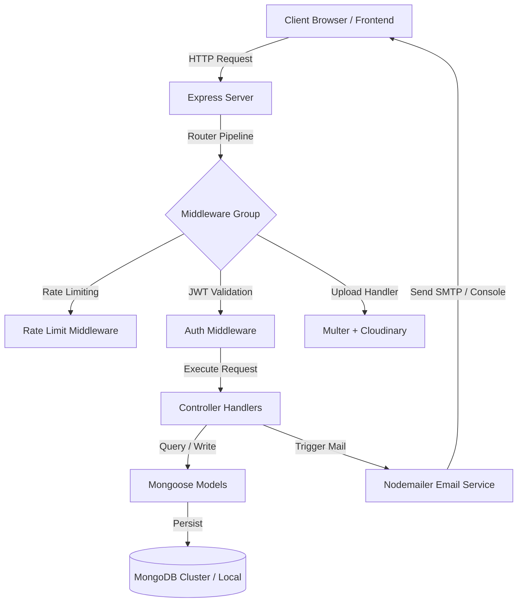

# ElderCare Connect - Backend API

[](https://nodejs.org/)
[](https://expressjs.com/)
[](https://www.mongodb.com/)
[](LICENSE)

ElderCare Connect Backend is a robust, production-ready REST API built using **Node.js**, **Express.js**, and **MongoDB**. It serves as the core coordinator for matching eldercare seekers with certified caregivers, managing bookings, sending automated email notifications, and processing caregiver credentials using Cloudinary.

---

## 🌟 Key Features
- **Role-Based Routing**: Secure access endpoints tailored for Patients, Caregivers, and Administrators.
- **Secure Authentication**: JWT-based login with hashed passwords via `bcryptjs`.
- **Credential Verification**: Native document upload validation (PDFs for degrees, JPEGs/PNGs for photos) with hybrid storage support (Cloudinary with local file fallback).
- **Automated Communication**: Verification and booking confirmation emails powered by Nodemailer.
- **Security Protocols**: API rate limiting, CORS configuration, input sanitization, and database indexing.

---

## 🛠️ Tech Stack
- **Core Platform**: Node.js (ES Modules syntax)
- **Web Framework**: Express.js
- **Database ORM**: Mongoose / MongoDB
- **Authentication**: JSON Web Tokens (JWT) & bcryptjs
- **Storage Integrations**: Cloudinary SDK & `multer-storage-cloudinary`
- **File Parsing**: Multer middleware
- **Email Dispatcher**: Nodemailer
- **Request Controller**: Express Rate Limit

---

## 📐 Architecture Overview
The backend is structured around a decoupled **MVC (Model-View-Controller)** pattern utilizing routing middleware for validation, upload management, and authentication:



1. **Routing & Middleware**: Request passes through rate limit filters, authentication checks (validating JWT tokens inside headers), and Multer storage parsers.
2. **Controller Layer**: Decoupled business logic parses inputs, interacts with database models, and dispatches asynchronous emails.
3. **Database Interactions**: Mongoose schemas map to collections, auto-populating relations (e.g., binding User records to Caregivers or Patient profiles).

---

## 📂 Folder Structure

```text
backend/
├── config/              # Database connection settings
│   └── db.js
├── controllers/         # Business logic for API endpoints
│   ├── authController.js
│   ├── bookingController.js
│   ├── careNoteController.js
│   ├── caregiverController.js
│   ├── patientController.js
│   ├── reviewController.js
│   └── serviceController.js
├── middleware/          # Security, error, rate-limiting, and upload middleware
│   ├── authMiddleware.js
│   ├── errorMiddleware.js
│   ├── rateLimitMiddleware.js
│   ├── uploadMiddleware.js
│   └── validationMiddleware.js
├── models/              # MongoDB Mongoose schemas
│   ├── Booking.js
│   ├── CareNote.js
│   ├── Caregiver.js
│   ├── Patient.js
│   ├── Review.js
│   ├── Service.js
│   └── User.js
├── routes/              # Express API route endpoints
│   ├── authRoutes.js
│   ├── bookingRoutes.js
│   ├── careNoteRoutes.js
│   ├── caregiverRoutes.js
│   ├── patientRoutes.js
│   ├── reviewRoutes.js
│   └── serviceRoutes.js
├── services/            # Automated email templates and mail transporter logic
│   └── emailService.js
├── templates/           # HTML templates for verification and booking emails
│   └── bookingConfirmationEmail.js
├── uploads/             # Directory for local fallback uploads (Git-ignored)
└── utils/               # Database seeder scripts and file formatting utilities
    ├── fileHelper.js
    └── seeder.js
```

---

## 🛡️ Key Security Features
- **Rate Limiting**: Limits requests on heavy operations (like verification token dispatching) to block denial-of-service/brute-force attacks.
- **Strict Input Validation**: Utilizes regex checks to block invalid emails and enforces 10-digit Indian phone number formatting.
- **Environment Isolation**: Production credentials (e.g. database connection strings, keys, secrets) are kept in local `.env` configuration (Git-ignored).

---

## 📑 API Documentation

### 🔒 Authentication Required Rules
- **Public**: Anyone can access.
- **Protected**: Requires a valid `Authorization: Bearer <JWT_TOKEN>` header.
- **Caregiver Only**: Requires JWT and caregiver role.
- **User Only**: Requires JWT and user (patient) role.
- **Admin Only**: Requires JWT and admin role.

---

### 🔑 Authentication Endpoints

#### `POST /api/auth/register`
- **Description**: Registers a new user, caregiver, or administrator.
- **Format**: Multipart Form-Data (for caregivers uploading profile photos) or JSON.
- **Authentication Required**: No (Public)
- **Request Body (Caregiver Multipart Example)**:
  - `name`: Rajesh Sharma
  - `email`: rajesh@eldercare.com
  - `password`: securepwd123
  - `phone`: 9876543210
  - `role`: caregiver
  - `specialization`: Registered Nurse
  - `experience`: 5
  - `serviceArea`: Noida, Uttar Pradesh
  - `hourlyRate`: 350
  - `profilePhoto`: (File Attachment - PNG/JPEG)
- **Success Response (201 Created)**:
  ```json
  {
    "_id": "603d2b2f2f7b4e3a4073fb11",
    "name": "Rajesh Sharma",
    "email": "rajesh@eldercare.com",
    "phone": "9876543210",
    "role": "caregiver",
    "emailVerified": false,
    "token": "eyJhbGciOiJIUzI1NiIsInR5cCI6IkpXVCJ9..."
  }
  ```

#### `POST /api/auth/login`
- **Description**: Authenticate credentials and return token.
- **Authentication Required**: No (Public)
- **Request Body**:
  ```json
  {
    "email": "nurse1@eldercare.com",
    "password": "caregiver123"
  }
  ```
- **Response (200 OK)**:
  ```json
  {
    "_id": "603d2b2f2f7b4e3a4073fb12",
    "name": "Priya Sharma",
    "email": "nurse1@eldercare.com",
    "phone": "9811223344",
    "role": "caregiver",
    "emailVerified": true,
    "token": "eyJhbGciOiJIUzI1NiIsInR5cCI6IkpXVCJ9..."
  }
  ```

#### `GET /api/auth/verify-email/:token`
- **Description**: Verifies the account using an email confirmation token.
- **Authentication Required**: No (Public)
- **Response (200 OK)**:
  ```json
  {
    "success": true,
    "message": "Email verified successfully. You can now log in."
  }
  ```

#### `POST /api/auth/upload-degree`
- **Description**: Allows caregivers to upload their qualification PDF.
- **Format**: Multipart Form-Data (`degreeDocument` attachment).
- **Authentication Required**: Yes (Caregiver)
- **Response (200 OK)**:
  ```json
  {
    "success": true,
    "message": "Degree document uploaded successfully.",
    "degreeDocument": "https://res.cloudinary.com/ElderCare/raw/upload/v1615/eldercare_uploads/degreeDocument-1615..."
  }
  ```

---

### 🧑‍⚕️ Caregiver Endpoints

#### `GET /api/caregivers`
- **Description**: Retrieves list of caregivers (Public view returns verified only; Admin returns all). Filterable by query params.
- **Authentication Required**: No (Public)
- **Query Params**: `specialization`, `serviceArea`, `verificationStatus`
- **Response (200 OK)**:
  ```json
  [
    {
      "_id": "603d2b2f2f7b4e3a4073fb15",
      "userId": {
        "_id": "603d2b2f2f7b4e3a4073fb12",
        "name": "Priya Sharma",
        "email": "nurse1@eldercare.com",
        "phone": "9811223344"
      },
      "specialization": "Registered Nurse",
      "qualification": "B.Sc in Nursing",
      "degreeDocument": "https://res.cloudinary.com/ElderCare/raw/upload/...",
      "experience": 5,
      "hourlyRate": 350,
      "serviceArea": "Connaught Place, New Delhi",
      "availability": ["Monday", "Wednesday", "Friday"],
      "verificationStatus": "verified",
      "profilePhoto": "https://res.cloudinary.com/ElderCare/image/upload/...",
      "rating": 5,
      "totalReviews": 1
    }
  ]
  ```

#### `POST /api/caregivers`
- **Description**: Creates or updates logged-in caregiver's profile attributes.
- **Format**: Multipart Form-Data (`profilePhoto` image and `degreeDocument` PDF).
- **Authentication Required**: Yes (Caregiver Only)
- **Response (200 OK)**: Returns the updated caregiver profile JSON.

#### `PUT /api/caregivers/:id/verify`
- **Description**: Update caregiver's verification state.
- **Authentication Required**: Yes (Admin Only)
- **Request Body**:
  ```json
  {
    "status": "verified"
  }
  ```
- **Response (200 OK)**: Returns success message and profile details.

---

### 📅 Booking Endpoints

#### `POST /api/bookings`
- **Description**: Users book caregiver services for a patient profile.
- **Authentication Required**: Yes (User Only)
- **Request Body**:
  ```json
  {
    "patientId": "603d2b2f2f7b4e3a4073fb20",
    "caregiverId": "603d2b2f2f7b4e3a4073fb15",
    "serviceId": "603d2b2f2f7b4e3a4073fb30",
    "bookingDate": "2026-06-25",
    "bookingTime": "11:00 AM",
    "duration": "2 hours"
  }
  ```
- **Response (201 Created)**: Returns the generated Booking JSON with status `pending`.

#### `PUT /api/bookings/:id/status`
- **Description**: Allows caregivers to accept/reject or users to cancel bookings. Triggers confirmation emails upon acceptance.
- **Authentication Required**: Yes (Owner / Admin)
- **Request Body**:
  ```json
  {
    "status": "accepted"
  }
  ```
- **Response (200 OK)**: Returns updated Booking JSON.

---

## 🔒 Environment Variables
Copy `backend/.env.example` to `backend/.env` and configure:

| Key | Description | Example Value |
| :--- | :--- | :--- |
| `PORT` | Local express listener port | `5000` |
| `NODE_ENV` | Run mode (development/production) | `development` |
| `MONGODB_URI` | MongoDB Connection URL | `mongodb://127.0.0.1:27017/eldercare-connect` |
| `JWT_SECRET` | Secret token signing passphrase | `yoursuperjwtsecretkeyhere123` |
| `BACKEND_URL` | Base API access endpoint | `http://localhost:5000` |
| `FRONTEND_URL` | Frontend client access host | `http://localhost:3000` |
| `SMTP_HOST` | Nodemailer outgoing SMTP server | `smtp.gmail.com` |
| `SMTP_PORT` | Nodemailer SMTP port | `587` |
| `SMTP_USER` | Email address dispatcher account | `support@example.com` |
| `SMTP_PASS` | App password associated with dispatcher | `lozanlnuokwacuab` |
| `SMTP_FROM` | Dispatcher identity display name | `"ElderCare Connect" <support@example.com>` |
| `CLOUDINARY_CLOUD_NAME` | Cloudinary Storage Account Name | `ElderCare` |
| `CLOUDINARY_API_KEY` | Cloudinary Account Access Key | `335335272132975` |
| `CLOUDINARY_API_SECRET` | Cloudinary Account Access Secret | `J0UdCu_yj9p0C_8QS9rBBzunlho` |

---

## 🗄️ Database Schema

### Users Collection (`users`)
- `name` (String, required): Display Name.
- `email` (String, required, unique): Login Identifier.
- `password` (String, required, hidden by default): Hashed bcrypt credential.
- `phone` (String, required, unique): Coordination contact number.
- `role` (String, default: `'user'`): Access group (`'user'`, `'caregiver'`, `'admin'`).
- `emailVerified` (Boolean, default: `false`): Status checklist.

### Caregivers Collection (`caregivers`)
- `userId` (ObjectId, ref: `'User'`, unique): Owner binding key.
- `specialization` (String, required): Care specialty title.
- `qualification` (String): Qualification/Institute summary.
- `degreeDocument` (String): Cloudinary/Local PDF URL path.
- `experience` (Number, required): Experience years.
- `hourlyRate` (Number, default: `0`): Booking charge rates in ₹.
- `serviceArea` (String, required): Covered cities/zones.
- `availability` (Array of Strings): Days active (e.g. `['Monday', 'Wednesday']`).
- `verificationStatus` (String, default: `'pending'`): Admin verify stage (`'pending'`, `'verified'`, `'rejected'`).
- `profilePhoto` (String): Hosted image URL.
- `rating` (Number, default: `0`): Running score.

---

## 🚀 Installation & Local Execution

### Prerequisites
- Node.js installed locally.
- MongoDB service running locally on default port `27017` or a MongoDB Atlas account connection string.

### Setup Instructions
1. Navigate into backend directory:
   ```bash
   cd backend
   ```
2. Install package dependencies:
   ```bash
   npm install
   ```
3. Initialize the `.env` settings:
   ```bash
   cp .env.example .env
   # Add your DB URI, SMTP credentials, and Cloudinary keys inside .env
   ```
4. Seeding Demo Data (Optional):
   Populates MongoDB with pre-registered user, caregiver, and service listings (localized for Indian names and Rupee values):
   ```bash
   npm run seed
   ```
5. Spin up development server (hot-reloads via nodemon):
   ```bash
   npm run dev
   ```

---

## 🌐 Deployment Guide

### Deployment on Render / Railway
1. **Repository Settings**: Push backend folder contents to GitHub.
2. **Service Setup**: Create a new Web Service pointing to your repository.
3. **Environment variables**: Input all key-value entries from your `.env` (such as `MONGODB_URI`, `JWT_SECRET`, and `CLOUDINARY_*` keys) in the platform's Environment Variables console.
4. **Build & Start Commands**:
   - Build Command: `npm install`
   - Start Command: `npm start`

---

## 📄 License
This project is licensed under the MIT License - see the LICENSE file for details.

## ✍️ Author
Developed with ❤️ by Ayush Kumar.
