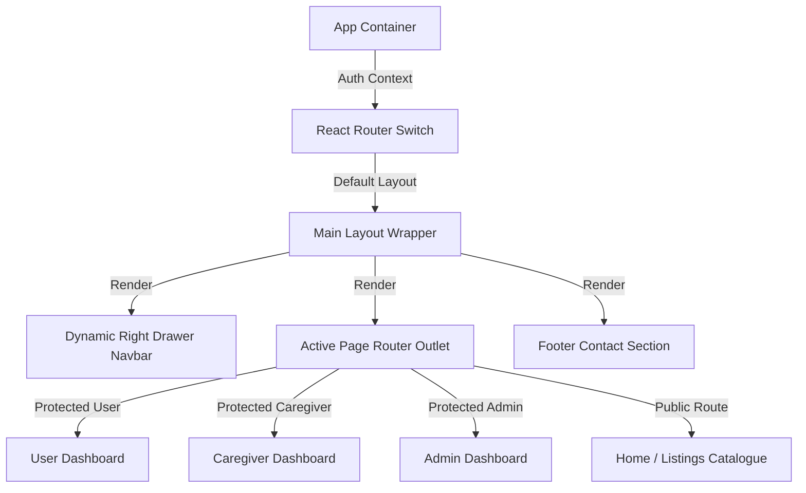

# ElderCare Connect - Frontend Portal

[](https://react.dev/)
[](https://vitejs.dev/)
[](https://tailwindcss.com/)
[](https://reactrouter.com/)

ElderCare Connect Frontend is a highly interactive, responsive Single Page Application (SPA) designed to link healthcare seekers with certified eldercare assistants and nurses. Built using **React 18**, **Tailwind CSS**, and **Vite**, the application delivers a premium, smooth user experience.

---

## 🌟 Key Features
- **Visual Excellence**: Modern aesthetics featuring curated HSL color themes, smooth gradients, subtle micro-animations, and glassmorphism.
- **Dynamic Right-Align Navigation Drawer**: Navbars adapt dynamically to role permissions (Admin, User, Caregiver) utilizing a slide-out drawer menu sliding from the right.
- **Role-Based Portals**:
  - **User (Patient/Family)**: Browse verified caregivers, book services in Indian Rupees (₹), review booking logs, submit ratings/reviews, and manage patient profiles.
  - **Caregiver**: Edit profile credentials, configure available days, upload certificates/photos (JPEG/PDF native file selectors), submit visit care notes, and track booking earnings.
  - **Administrator**: Manage system services, toggle verification statuses, access earnings analytics, and review caregiver qualifications.
- **Real-Time Validations**: Native file selectors enforcing images for photos, PDFs for qualifications, and Indian phone number formatting regex constraints.

---

## 🛠️ Tech Stack
- **Library Platform**: React 18 (Hooks, Context API)
- **Styling Utility**: Tailwind CSS (Utility-first styling grid system)
- **Task Tooling**: Vite (Superfast module bundler)
- **Routing Engine**: React Router DOM v6 (Nested routers, protected auth guards)
- **API Request Client**: Axios
- **Icon Assets**: Lucide React

---

## 📐 UI Architecture
The UI is engineered with nested route layers wrapped in shared master layouts and authorization guards:



1. **Auth Provider**: `AuthContext` wraps the route tree, providing user roles, status, and bearer headers to secure requests.
2. **Dynamic Drawer Navigation**: Triggers a slide-out navigation panel (from the right margin `right-0`) containing context-specific links.
3. **Protected Guard Wrapper**: Enforces token authentication and rejects unauthorized role access (redirecting users to `/login`).

---

## 📂 Folder Structure

```text
frontend/
├── public/              # Static public resources
├── src/
│   ├── components/      # Shared reusable components
│   │   ├── Footer.jsx
│   │   ├── Navbar.jsx
│   │   └── ProtectedRoute.jsx
│   ├── context/         # AuthContext state provider
│   │   └── AuthContext.jsx
│   ├── layouts/         # Main master layouts
│   │   └── MainLayout.jsx
│   ├── pages/           # Dynamic router page views
│   │   ├── About.jsx
│   │   ├── AdminBookings.jsx
│   │   ├── AdminDashboard.jsx
│   │   ├── Analytics.jsx
│   │   ├── Availability.jsx
│   │   ├── BookingManagement.jsx
│   │   ├── BookingRequests.jsx
│   │   ├── CareNotes.jsx
│   │   ├── CaregiverDashboard.jsx
│   │   ├── CaregiverEarnings.jsx
│   │   ├── CaregiverListing.jsx
│   │   ├── CaregiverProfile.jsx
│   │   ├── CaregiversManagement.jsx
│   │   ├── Home.jsx
│   │   ├── Login.jsx
│   │   ├── PatientProfiles.jsx
│   │   ├── Register.jsx
│   │   ├── ServiceManagement.jsx
│   │   ├── Services.jsx
│   │   ├── UserDashboard.jsx
│   │   └── UsersManagement.jsx
│   ├── services/        # HTTP Axios API request clients
│   ├── utils/           # Path formatters and constants
│   │   └── url.js
│   ├── App.jsx          # Router paths declarations
│   ├── index.css        # Main design tokens and utilities
│   └── main.jsx         # App mounting entrypoint
├── tailwind.config.js   # Tailwinds color palette configurations
└── vite.config.js       # Vite build and proxy settings
```

---

## 📑 Pages and Routes Catalog

### 🌐 Public Pages
- `Home.jsx` (`/`): Landing page highlighting services, emergency numbers, and caregiver catalog highlights.
- `About.jsx` (`/about`): Care coordinators vision and team introduction.
- `Services.jsx` (`/services`): Catalog pricing table in Indian Rupees (₹).
- `Login.jsx` (`/login`) & `Register.jsx` (`/register`): Roles selector and auth portal. Supports native file upload for caregivers.

### 🧑‍💼 User (Patient) Pages
- `UserDashboard.jsx` (`/user/dashboard`): Lists upcoming bookings, ongoing activities, completed service reviews, and rating modals. Shares caregiver phone numbers once requests are accepted.
- `PatientProfiles.jsx` (`/user/patients`): Patient record catalog creation editor (Medical conditions, age, emergency contact).
- `CaregiverListing.jsx` (`/caregivers`): Caregiver search catalog filterable by city/area and specialties, rendering custom hourly rates and weekday availability.

### 🧑‍⚕️ Caregiver Pages
- `CaregiverDashboard.jsx` (`/caregiver/dashboard`): Summary dashboard showing profile validation state badges (`Verified` / `Not Verified`), earnings charts, and schedule request listings.
- `CaregiverProfile.jsx` (`/caregiver/profile`): Profile editor with native file upload selectors for Profile Photo (JPEG/PNG) and Degree Certificate (PDF).
- `Availability.jsx` (`/caregiver/availability`): Configuration checklist for active service days.
- `CaregiverEarnings.jsx` (`/caregiver/earnings`): Analytics charts indicating completed booking income.
- `BookingRequests.jsx` (`/caregiver/requests`): List of pending coordination booking invitations to accept/reject.
- `CareNotes.jsx` (`/caregiver/notes`): Visit summaries and vitals reporting logs.

### 🔑 Admin Pages
- `AdminDashboard.jsx` (`/admin/dashboard`): Master control center showing user volumes and quick stats.
- `CaregiversManagement.jsx` (`/admin/caregivers`): Caregiver document verification console featuring degree PDF preview links and approval switches.
- `UsersManagement.jsx` (`/admin/users`): System users catalog and deletion panel.
- `ServiceManagement.jsx` (`/admin/services`): Pricing database configurations panel.

---

## ⚙️ Environment Variables
Vite environment variables require a `VITE_` prefix:

| Key | Description | Example Value |
| :--- | :--- | :--- |
| `VITE_API_URL` | Base Backend production server domain URL | `http://localhost:5000` |

---

## 🚀 Installation & Local Execution

### Prerequisites
- Node.js installed locally.
- Backend server running on port `5000`.

### Setup Instructions
1. Navigate into frontend directory:
   ```bash
   cd frontend
   ```
2. Install client dependencies:
   ```bash
   npm install
   ```
3. Initialize the development build server (runs on port `5173` with proxy configurations active):
   ```bash
   npm run dev
   ```

---

## 🏗️ Production Build & Deployment

### Build for Production
Compiles optimization bundle inside the `dist/` directory:
```bash
npm run build
```

### Static Host Deployment (e.g. Netlify / Vercel)
1. Set Vercel/Netlify repository root directory to `frontend`.
2. Configure environment variables in the host dashboard:
   - `VITE_API_URL` = (Your backend deployed production URL, e.g. `https://eldercare-api.onrender.com`).
3. Set the build commands:
   - Build Command: `npm run build`
   - Output Directory: `dist`
4. Deploy.

---

## 📄 License
This project is licensed under the MIT License - see the LICENSE file for details.

## ✍️ Author
Developed with ❤️ by Ayush Kumar.
